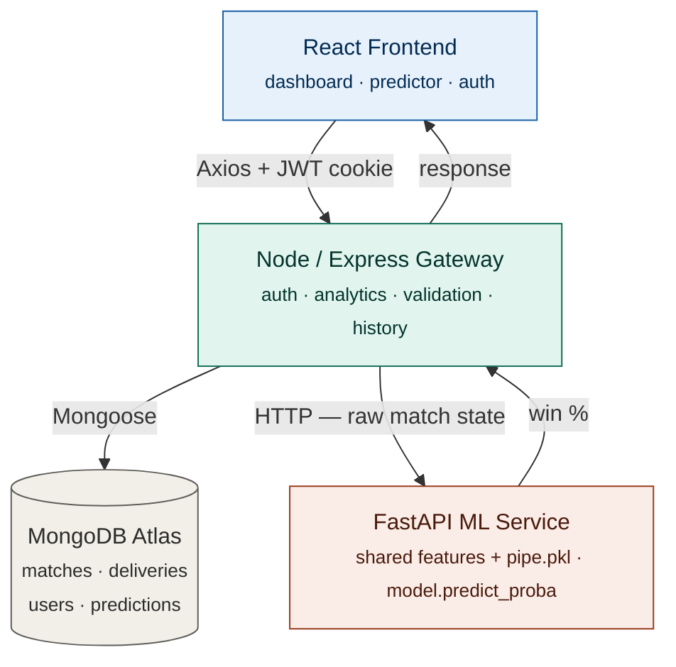

# IPL Prediction Platform

A full-stack analytics and machine-learning platform built on 17 seasons of Indian Premier League data. It serves live win-probability predictions for a run chase, surfaces deep historical analytics computed from ball-by-ball data, and gives signed-in users a saved history of their predictions.

The project is built as **three independent services** — a React frontend, a Node/Express API gateway, and an isolated Python ML service — each doing the job it is best suited to. The architecture is the point: it demonstrates connecting a machine-learning model to a real product through a clean service boundary, rather than bolting a model onto a single app.

---

## Deployed Links

- **Frontend:** https://your-frontend.vercel.app
- **Node API:** https://your-backend.onrender.com
- **ML Service:** https://your-ml.onrender.com

*(Replace these with your live URLs after deploying.)*

---

## Project Overview

The platform answers one question in real time — *"what is the batting team's chance of winning this chase?"* — and backs it with historical context.

1. **Live ML inference.** A user enters the live match situation (teams, city, target, score, overs, wickets). The request flows through the Node gateway to the Python ML service, which engineers cricket features and returns a win probability.
2. **Historical analytics.** Aggregation pipelines over ~261k deliveries compute team standings, head-to-head records, top run-scorers and wicket-takers, venue scoring patterns, and season trends — all live from MongoDB.
3. **Authentication with a purpose.** The predictor is open to everyone, but signing in saves each prediction to a personal history shown on the dashboard.
4. **Clean service separation.** The trained model is a Python artifact, so it lives in a Python (FastAPI) service. Everything else — auth, analytics, the data layer — is JavaScript, in Node/Express.

---

## Tech Stack

### Frontend

- React 19
- Vite
- Tailwind CSS
- React Router 7
- Axios
- Recharts

### Backend (API Gateway)

- Node.js (ES Modules)
- Express 5
- MongoDB + Mongoose
- JWT authentication (access + refresh tokens, httpOnly cookies)
- bcryptjs (password hashing)
- csv-parser (streaming data ingestion)

### Machine-Learning Service

- FastAPI
- scikit-learn (logistic-regression pipeline)
- pandas
- Pydantic (request validation)

### Deployment

- Frontend: Vercel
- Both backends: Render
- Database: MongoDB Atlas

---

## Core Features

### Authentication and Authorization

- Email/password registration and login
- JWT-based sessions stored in secure httpOnly cookies
- Passwords hashed with bcrypt (never stored in plain text)
- Refresh-token flow that silently issues new access tokens without re-login
- **Two-tier auth on the predictor:** anyone can predict (soft/optional auth), but a logged-in user's prediction is saved to their history
- Protected routes (the dashboard and prediction history require login)

### Win-Probability Predictor

- Enter live 2nd-innings match state and get the batting team's win probability
- The model output is shown as a live broadcast-style probability bar
- Engineered features (runs left, balls left, wickets left, current and required run rate) are displayed alongside the result
- Open to anonymous users; signing in saves the prediction

### Historical Analytics Dashboard

Computed live from MongoDB aggregation pipelines:

- Overview cards: total matches, total deliveries, seasons, and toss-to-win correlation
- Head-to-head record between any two franchises
- Team standings (wins by team, with renamed franchises normalized)
- All-time top run-scorers (with strike rate) and wicket-takers (bowler-credited only)
- Per-venue average first-innings totals
- Matches per season trend

### Prediction History

- Each prediction made while logged in is saved to MongoDB
- The dashboard shows a "Your recent predictions" table (matchup, situation, win %, date)
- History is private — a user only sees their own predictions

### UI / UX

- Responsive dark "pitch at dusk" theme with a single accent color
- Sticky navigation that adapts to auth state
- Loading and skeleton states for charts and tables
- Smooth, themed chart tooltips
- Mobile-friendly layout

---

## The Machine-Learning Model

A scikit-learn `Pipeline` (`OneHotEncoder` on the categorical columns + `LogisticRegression`) trained on every recorded 2nd-innings chase. It predicts the probability that the **batting team** completes the chase.

| Metric | Value |
| --- | --- |
| Accuracy | ~81.4% |
| F1 score | ~0.80 |
| Test set | 18,014 deliveries |
| Training data | 1,095 matches · 260,920 deliveries |

**Features (exact order):** `batting_team`, `bowling_team`, `city`, `runs_left`, `balls_left`, `wickets_left`, `target`, `crr`, `rrr`.

The OneHotEncoder lives **inside** the saved pipeline, so the serving code passes raw strings and the same transformer that trained the model also transforms requests — there is no separate encoding step to keep in sync.

### Avoiding train/serve skew

The model learns from engineered features (`runs_left`, `crr`, `rrr`, …) that are produced by formulas. Those formulas live in **one shared module** (`backend-ml/features.py`), imported by both the training pipeline and the FastAPI service. If training and serving computed features differently, the model would receive inputs that don't match what it learned from — a silent bug known as train/serve skew. A single source of truth makes that impossible, and `backend-ml/tests/check_parity.py` asserts the two paths agree.

### Lightweight training pipeline

Training is organized as a clean, staged pipeline — `ingest → clean → features → train → evaluate` — driven by a `config.yaml` so the model can be retrained without editing code. It is deliberately lightweight plain Python (no heavyweight orchestration), because this project's focus is the product, not ML operations.

---

## System Architecture



A prediction flows **Frontend → Node → FastAPI → back**. Node validates the request and forwards the raw match state; FastAPI computes the model features (with the same code the model was trained on) and predicts. Node stays a clean gateway: auth, analytics, the data layer, and proxying this one ML call.


---

## Project Workflows

### 1. Authentication Workflow

```txt
User opens app
    |
    v
Login / Register page
    |
    |-- Email + password
    |
    v
Backend verifies credentials (bcrypt)
    |
    v
Backend issues JWT access + refresh tokens as httpOnly cookies
    |
    v
Protected pages (dashboard, history) become accessible
```

The cookie is sent automatically with every request; the backend middleware verifies it and attaches the logged-in user to the request.

### 2. Prediction Workflow

```txt
User fills the predictor form (teams, city, target, score, overs, wickets)
    |
    v
Frontend POSTs match state to the Node gateway
    |
    v
Node validates input, forwards raw state to the FastAPI ML service
    |
    v
FastAPI engineers features (shared module) and runs the model
    |
    v
Win/loss probability + engineered features returned to the frontend
    |
    |-- If the user is logged in:
    |       Node saves the prediction to MongoDB
    |
    v
Frontend shows the win-probability bar and the feature breakdown
```

### 3. Analytics Workflow

```txt
Dashboard loads
    |
    v
Frontend requests analytics endpoints from Node
    |
    v
Node runs MongoDB aggregation pipelines over matches + deliveries
    |
    v
Aggregated results (standings, head-to-head, leaderboards, trends) returned
    |
    v
Frontend renders charts, cards, and tables
```

### 4. Prediction History Workflow

```txt
Logged-in user opens the dashboard
    |
    v
Frontend requests /predict/history (protected route)
    |
    v
Node returns that user's saved predictions, newest first
    |
    v
"Your recent predictions" table is displayed
```

---

## Environment Variables

### backend-node/.env

```env
PORT=8001
MONGODB_URI=your_mongodb_atlas_connection_string

CORS_ORIGIN=http://localhost:5173

ACCESS_TOKEN_SECRET=your_long_random_secret
ACCESS_TOKEN_EXPIRY=1d
REFRESH_TOKEN_SECRET=your_other_long_random_secret
REFRESH_TOKEN_EXPIRY=10d

ML_SERVICE_URL=http://localhost:8002
```

Generate strong secrets with:

```bash
node -e "console.log(require('crypto').randomBytes(48).toString('hex'))"
```

### backend-ml/.env

```env
MODEL_PATH=pipe.pkl
CORS_ORIGINS=http://localhost:5173,http://localhost:8001
```

### frontend-react/.env

```env
VITE_API_URL=http://localhost:8001/api/v1
```

---

## Running Locally

You will need **Node.js 18+**, **Python 3.10-3.12**, and a **MongoDB Atlas** account (free tier).

### 1. Clone the repository

```bash
git clone https://github.com/NILAMBARMANDAL/ipl-prediction-platform.git
cd ipl-prediction-platform
```

### 2. Start the ML service

```bash
cd backend-ml
python -m venv .venv
# Windows:   .venv\Scripts\Activate.ps1
# Mac/Linux: source .venv/bin/activate
pip install -r requirements.txt
uvicorn main:app --reload --port 8002
```

Check it: open `http://localhost:8002/health` -> `{"status":"ok","model_loaded":true}`.

The trained model (`pipe.pkl`) is included, so the service works immediately. To retrain it, place the CSVs in `backend-node/data/` (see step 3) and run `python training/pipeline.py`.

### 3. Get the data and seed MongoDB

Download the dataset (two files: `matches.csv` and `deliveries.csv`) — for example, the [IPL Complete Dataset on Kaggle](https://www.kaggle.com/datasets/patrickb1912/ipl-complete-dataset-20082020) — and place both in `backend-node/data/`.

```bash
cd backend-node
cp .env.example .env     # then fill in MONGODB_URI + the two token secrets
npm install
npm run seed             # one-time: streams the CSVs into MongoDB
```

The seed script streams the CSV in batches, so memory stays flat even though `deliveries.csv` has ~261k rows. Re-running is safe — it clears and reloads. Make sure MongoDB Atlas allows your current IP (`0.0.0.0/0` for development).

### 4. Start the Node backend

```bash
npm run dev
```

Check it: `http://localhost:8001/api/v1/health` and `http://localhost:8001/api/v1/analytics/overview` (should show real numbers).

### 5. Start the frontend

```bash
cd ../frontend-react
cp .env.example .env
npm install
npm run dev
```

Open `http://localhost:5173`.

### Ports

| Service | Port |
| --- | --- |
| Frontend (Vite) | 5173 |
| Node backend | 8001 |
| FastAPI ML | 8002 |

---

## Key API Endpoints

Base URL: `/api/v1`

### Auth

```txt
POST /users/register
POST /users/login
POST /users/logout            (protected)
POST /users/refresh-token
GET  /users/current-user      (protected)
```

### Prediction

```txt
POST /predict                 (open; saves history if logged in)
GET  /predict/history         (protected — your own predictions)
```

### Analytics

```txt
GET /analytics/overview
GET /analytics/team-standings
GET /analytics/head-to-head?team1=&team2=
GET /analytics/top-batsmen?limit=
GET /analytics/top-bowlers?limit=
GET /analytics/venue-stats?limit=
GET /analytics/season-trend
```

All responses use a consistent envelope: `{ statusCode, data, message, success }`.

---

## Deployment

The three services deploy to two platforms — **both backends on Render**, the **frontend on Vercel**. Deploy in this order, because each step produces a URL the next one needs.

### 1. ML Service (Render)

- New Web Service -> connect this repo
- **Root Directory:** `backend-ml`
- **Build Command:** `pip install -r requirements.txt`
- **Start Command:** `uvicorn main:app --host 0.0.0.0 --port $PORT`
- **Env:** `CORS_ORIGINS=*` (tighten later)
- After deploy, note the URL and check `/health`.

### 2. Node Backend (Render)

- New Web Service -> same repo
- **Root Directory:** `backend-node`
- **Build Command:** `npm install`
- **Start Command:** `node src/index.js`
- **Env:**

```env
MONGODB_URI=your_atlas_string
ACCESS_TOKEN_SECRET=...
REFRESH_TOKEN_SECRET=...
ACCESS_TOKEN_EXPIRY=1d
REFRESH_TOKEN_EXPIRY=10d
ML_SERVICE_URL=https://your-ml.onrender.com
CORS_ORIGIN=https://your-frontend.vercel.app
NODE_ENV=production
```

- Seed the production database by running `npm run seed` locally pointed at the same Atlas cluster.

### 3. Frontend (Vercel)

- Import the repo
- **Root Directory:** `frontend-react`
- **Framework Preset:** Vite (auto-detected)
- **Env:** `VITE_API_URL=https://your-backend.onrender.com/api/v1`
- After deploy, go back to the Node service on Render and set `CORS_ORIGIN` to the exact Vercel URL, then redeploy.

For React Router refresh support on Vercel, a `vercel.json` with a catch-all rewrite to `index.html` is included in the frontend folder.

### A note on cross-site cookies

Because auth uses an httpOnly cookie and the frontend (Vercel) and backend (Render) are on different domains, the cookie is sent cross-site. The code handles this: in production it sets `secure: true` and `sameSite: "none"`, both of which require HTTPS — which Vercel and Render provide automatically. If login doesn't persist, confirm `NODE_ENV=production` is set and `CORS_ORIGIN` exactly matches the Vercel URL (no trailing slash).

---

## Project Structure

```txt
ipl-prediction-platform/
├── backend-node/             # Express API gateway
│   ├── src/
│   │   ├── controllers/      # analytics, predict, user
│   │   ├── models/           # match, delivery, user, prediction
│   │   ├── routes/           # versioned under /api/v1
│   │   ├── middlewares/      # JWT auth (required + optional)
│   │   ├── utils/            # asyncHandler, ApiError, ApiResponse
│   │   ├── db/               # MongoDB connection
│   │   ├── app.js
│   │   └── index.js
│   ├── scripts/seedIplData.js
│   └── data/                 # place matches.csv + deliveries.csv here
├── backend-ml/               # FastAPI ML service
│   ├── features.py           # shared feature engineering (single source of truth)
│   ├── main.py               # inference API
│   ├── pipe.pkl              # trained model
│   ├── tests/check_parity.py # train/serve skew guard
│   └── training/             # staged pipeline + config.yaml
└── frontend-react/           # React + Vite app
    └── src/
        ├── pages/            # Home, Predictor, Dashboard, Login, Register
        ├── components/
        ├── context/          # AuthContext
        ├── hooks/
        └── services/         # configured Axios instance
```

---

Built by Nilambar Mandal.
