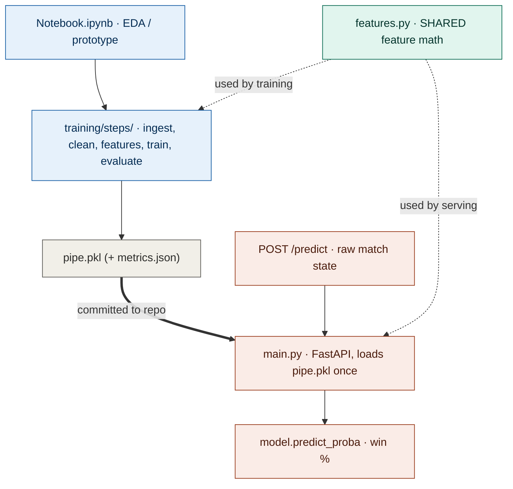

# IPLLab — ML Service & Training (FastAPI + lightweight pipeline)

Two things live here: the **inference service** (FastAPI) and a **lightweight, staged training pipeline**. They share one feature-engineering module so they can never drift apart.

---

## Why this is structured the way it is

The companion *Predictive Maintenance* project uses heavyweight MLOps tooling (ZenML, MLflow, Prometheus) because there the ML lifecycle **is** the project. This IPL project's focus is the **product** (the web app), so the training here is deliberately lightweight: a clear staged flow in plain Python, driven by `config.yaml`, with a simple `metrics.json` instead of an experiment tracker. Matching the weight of tooling to the job is the point — heavyweight orchestration here would be over-engineering.

---

## How it fits together

Training runs **offline** to produce `pipe.pkl`. Serving runs **online** and loads that file. The same `features.py` feeds both — which is what prevents train/serve skew.



---

## Layout

```
backend-ml/
├── features.py            # SHARED feature engineering — single source of truth
├── main.py                # FastAPI inference service
├── pipe.pkl               # trained pipeline (committed so it runs out of the box)
├── tests/
│   └── check_parity.py    # proves training & serving features match (anti-skew)
└── training/
    ├── pipeline.py        # orchestrates the 5 stages (plain Python, no ZenML)
    ├── config.yaml        # paths, split, model params — retrain with no code edits
    ├── metrics.json       # written by the evaluate stage
    ├── Notebook.ipynb     # original EDA, kept for provenance
    └── steps/
        ├── ingest.py      # load CSVs
        ├── clean.py       # standardize teams, compute target
        ├── features.py    # engineer per-ball features (uses shared formulas)
        ├── train.py       # fit the pipeline
        └── evaluate.py    # accuracy/precision/recall/F1 to metrics.json
```

---

## The train/serve skew guard (the important bit)

The model learns from engineered features (`runs_left`, `crr`, `rrr`, …). Those formulas live in exactly **one** place — `features.py` — imported by both the training pipeline and the FastAPI service. If training and serving computed features differently, the model would be fed inputs that don't match what it learned from, and predictions would be silently wrong. One shared module makes that impossible. `tests/check_parity.py` asserts the two paths agree.

---

## The model

Logistic-regression pipeline (`OneHotEncoder` on `batting_team` / `bowling_team` / `city` + passthrough numerics), trained on every recorded 2nd-innings chase. Predicts the batting team's chance of completing the chase.

| Metric | Value |
| --- | --- |
| Accuracy | ~81% |
| F1 score | ~0.80 |

The encoder is **inside** the pipeline, so serving passes raw strings and the same encoder transforms them — no separate encoding step to keep in sync.

---

## API

The service takes **raw match state** and computes features internally (with the shared module), so callers don't need to know the cricket math.

| Route | Notes |
| --- | --- |
| `GET /health` | `{ status, model_loaded }` — also used by uptime monitoring |
| `POST /predict` | body: `{ batting_team, bowling_team, city, target, current_score, overs, wickets }` returns `{ win_probability, loss_probability, features }` |

`overs` is cricket notation (e.g. `10.3` = 10 overs, 3 balls). Pydantic validates ranges, returning a clean `422` on bad input. Interactive docs at `/docs`.

---

## Running

```bash
pip install -r requirements.txt

# (Re)train — needs the CSVs in ../backend-node/data/
python training/pipeline.py

# Verify training/serving feature parity
python tests/check_parity.py

# Serve
uvicorn main:app --reload --port 8002
```

---

## Retraining

Edit `training/config.yaml` (data paths, test split, model hyperparameters) and re-run `python training/pipeline.py`. No code changes needed — the fitted pipeline is written to `pipe.pkl` where the service loads it.

> **Note:** the config controls the data, split, and logistic-regression *hyperparameters*. The algorithm itself is set in `train.py`; swapping to a different model (e.g. gradient boosting) is a small code change there, not a config edit.
